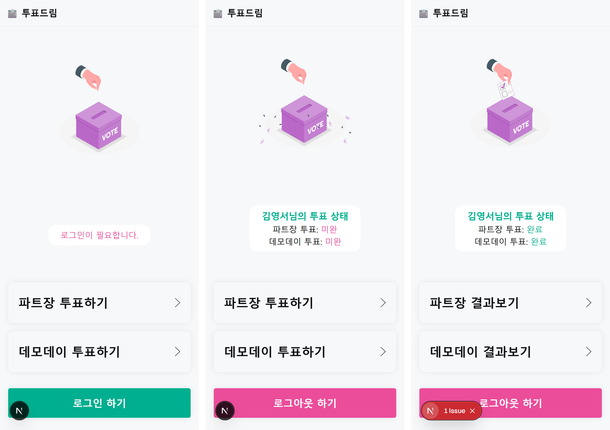
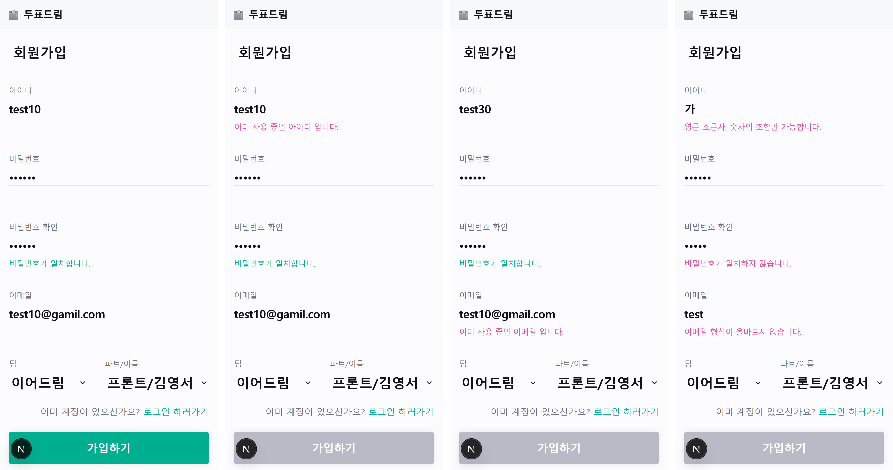
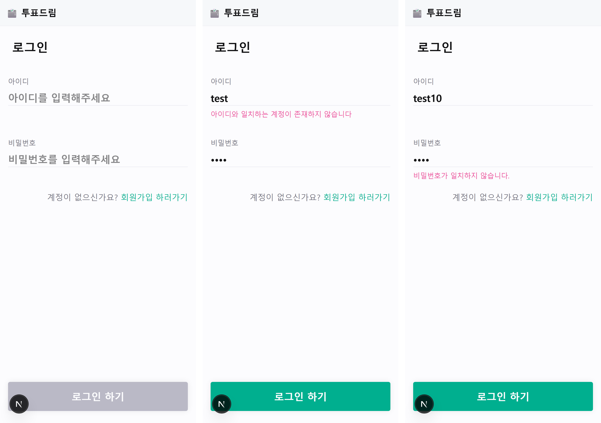
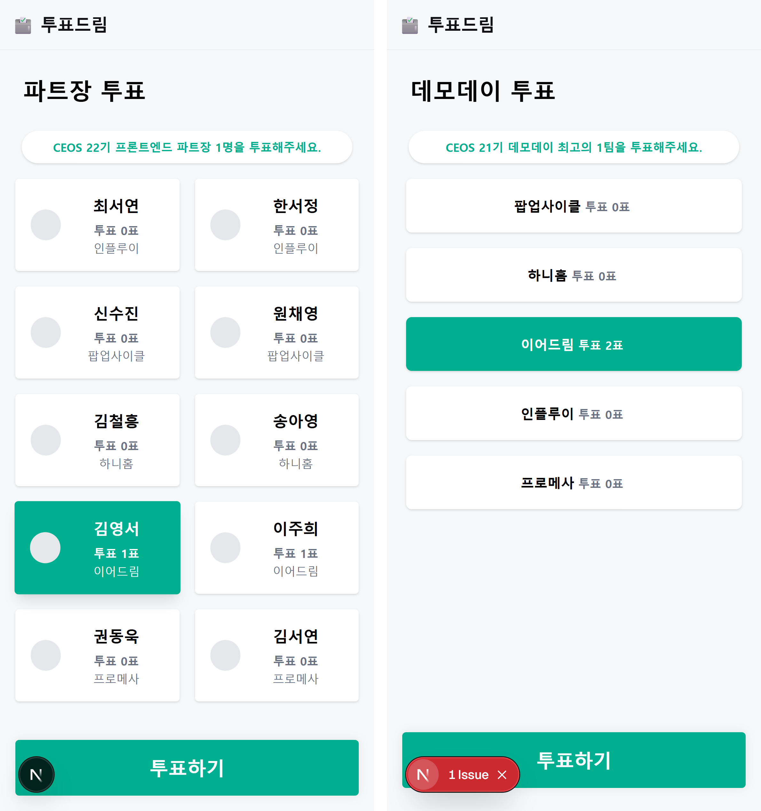
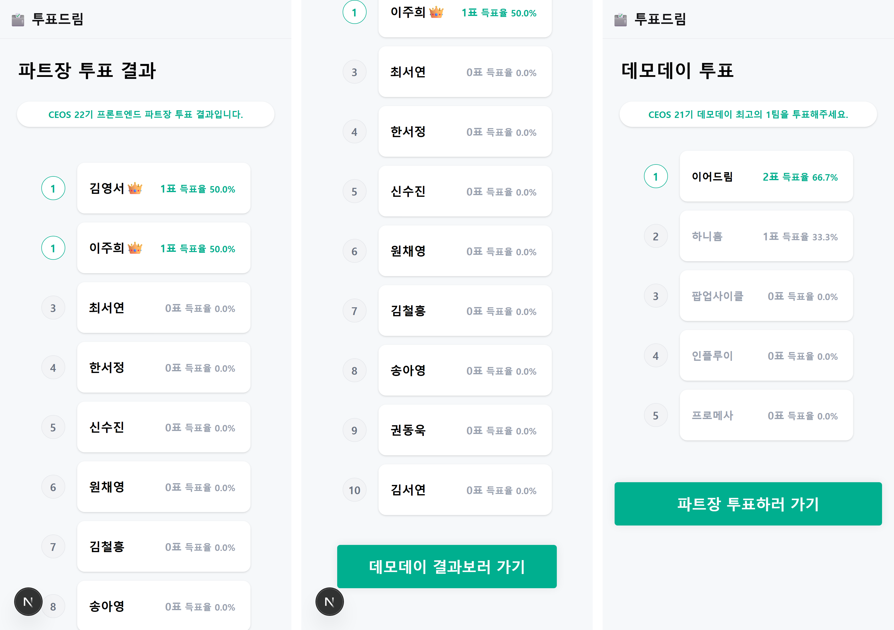

# next-vote-21th

## CEOS 21기 이어드림 투표 페이지

## 배포 [🗳️투표드림](https://next-vote-21th-omega.vercel.app/)

### home

1. 로그인 유무에 따른 로그인/로그아웃 버튼
2. 나의 투표 상태 표시
3. 투표 여부에 따른 투표하기/결과보기 버튼

### signup

1. 입력값의 유효성 확인 및 가입하기 버튼 disable/able
2. 아이디/이메일 중복 처리

### login

1. 아이디 불일치 확인
2. 비밀번호 불일치 확인

### vote

1. 파트장 투표
2. 데모데이 투표

### result

1. 1등 동점자 처리
2. 득표 수, 득표율 표시
3. 투표 완료된 경우 하단에 결과 보기로 이동 / 미완인 경우 투표하기로 이동

---

## 역할 분담

1. 프론트엔드
   1. 김영서 [@kkys00](https://github.com/kkys00)
      1. [피그마 디자인](https://www.figma.com/design/35IM3f0mGvcA6u3BGixE2O/CEOS-DreaDream-VoteDream?node-id=0-1&t=25welsMh8qPxUilY-1)
      2. 홈, 로그인, 회원가입 페이지 퍼블리싱
      3. 로그인, 회원가입 api 연결
      4. 투표 상태 보기 api 연결
   2. 이주희(@BeanMouse)
      1. 파트장 투표, 데모데이 투표, 투표 결과 페이지 퍼블리싱
      2. 투표하기, 투표 결과보기 api 연결
2. 백엔드
   1. 한혜수 - 로그인, 회원가입 api
   2. 오지현 - 투표 api

---

## **미션**

### **목표**

- ✅ REST API를 활용하여 서버와의 통신 방식을 이해합니다.
- ✅ JavaScript의 비동기 처리 방식(`async/await`, Promise)을 익힙니다.
- ✅ API 문서를 바탕으로 백엔드와 소통하는 방법을 학습합니다.[❤️swagger](https://vote-dream.p-e.kr/swagger-ui/index.html#)
- ✅ 팀 내 협업을 통해 효율적인 역할 분담을 고민하고 적용합니다.

---

### **기한**

- **2025년 5월 24일 토요일**까지 1차 필수 구현 사항이 적용된 중간 결과물을 제출해주세요.
- **2025년 6월 28일 토요일**까지 2차 필수 구현 사항까지 전부 적용된 최종 결과물을 제출해주세요.

---

### **1차 필수 구현 사항**

1. ✅ **프로젝트 세팅**

   - ✅ Next.js의 특성을 고려하여 효과적인 폴더 구조를 고민해 봅니다.
     1. 공통 컴포넌트 `src/components`
     2. 페이지 컴포넌트 `[page]/_components`
     3. 회원가입, 로그인 페이지 `src/app/auth/...`
   - ✅ API 통신, 스타일링, 전역 상태 관리 및 기타 라이브러리 등을 팀원과 상의하여 세팅합니다.
     1. API 통신은 투표드림에서는 `js fetch`를, 이어드림 프로젝트에서는 `axios`를 사용하기로 했습니다.
     2. 스타일링 `tailwindcss`
     3. 전역 상태 관리 `zustand`
     4. 기타 라이브러리 - 테일윈드 클래스 정렬 `prettier-plugin-tailwindcss`

2. ✅ **퍼블리싱**

   - ✅ 프로젝트에 필요한 모든 화면을 퍼블리싱합니다.
   - ✅ 다양한 디바이스에서 최적의 사용자 경험을 제공하기 위해 반응형 디자인을 적용합니다.

3. **로그인 기능**
   - ✅ 사용자는 아이디와 비밀번호를 입력하여 로그인할 수 있습니다.
   - 로그인 시 JWT를 통해 인증을 처리합니다.
     - ✅ 쿠키 저장까지
   - ✅ 아이디 또는 비밀번호가 틀렸을 경우, 에러 메시지를 표시합니다.
   - ✅ 로그아웃 기능을 구현합니다.
   - **백에서 서버 배포가 안 되었을 경우**에는 다음 주로 넘겨도 괜찮습니다.

### **2차 필수 구현 사항**

1. ✅ **투표 기능**

   - ✅ 로그인한 사용자는 투표에 참여할 수 있습니다.
   - ✅ 각 후보에 대한 투표 수를 실시간으로 확인할 수 있습니다.
   - ✅ 사용자는 한 번만 투표할 수 있으며, 중복 투표를 방지합니다.
     - alert을 띄우고 결과 페이지로 바로 이동

2. ✅ **후보 목록 조회**

   - ✅ 모든 사용자는 후보자의 목록과 상세 정보를 확인할 수 있습니다.
   - ✅ 후보자의 이름, 사진, 소개 등을 표시합니다.
     1. 프론트/백엔드 여부에 따라 후보자 목록 8명 표시
     2. 후보자의 이름, 사진(회색 동그라미), 소개(팀명) 표시

3. ✅ **투표 결과 조회**

   - ✅ 투표 종료 후, 모든 사용자는 최종 투표 결과를 확인할 수 있습니다.
     - 본인 투표 종료 직후 실시간으로 투표 결과(득표 수) 확인 가능
   - ✅ 각 후보자의 득표 수와 득표율을 시각적으로 표현합니다.
     1. 득표 수 표시
     2. 득표율 표시
     3. 1등에게 👑 이모지 표시

4. ✅ **에러 처리**
   - ✅ 서버 오류, 네트워크 문제 등 다양한 에러 상황에 대한 처리를 구현합니다.
     1. 회원가입 - 아이디 중복 오류, 이메일 중복 오류, 비밀번호와 비밀번호 확인 불일치 및 포맷 불일치 오류 처리 완료
     2. 로그인 - 계정 없음(아이디 불일치) 오류, 비밀번호 불일치 오류 처리
     3. 투표 - 중복 투표 불가 처리
   - ✅ 사용자에게 이해하기 쉬운 에러 메시지를 제공합니다.

---

### **선택 사항**

- ✅ `fetch` API 요청 방식은 자유롭게 선택 가능 (예: Fetch API, axios 등).
- ✅ `async/await` 최신 자바스크립트 스타일에 익숙해지기 위해 `Promise.then()` 대신 `async/await`를 사용해 보세요.

## **Key Question**

- Zod 스키마가 무엇인지, 어떻게 활용할 수 있는지 알아봅시다.
- 이번 프로젝트에서 토큰 관리를 어떻게 할 예정인지, 그리고 왜 그런 방법을 선택했는지에 대해 설명해 주세요.
